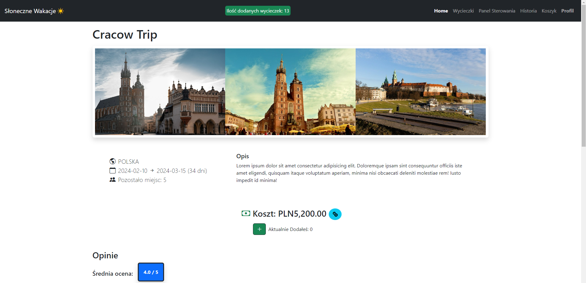
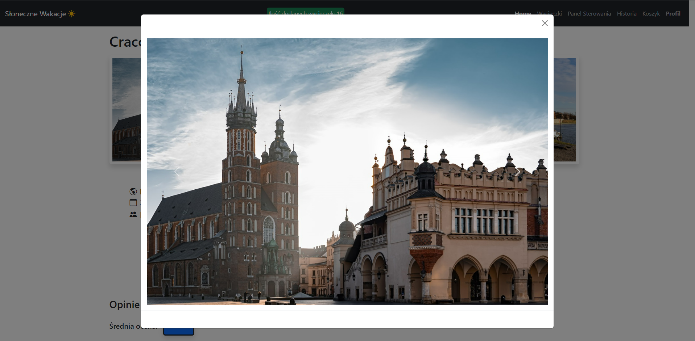
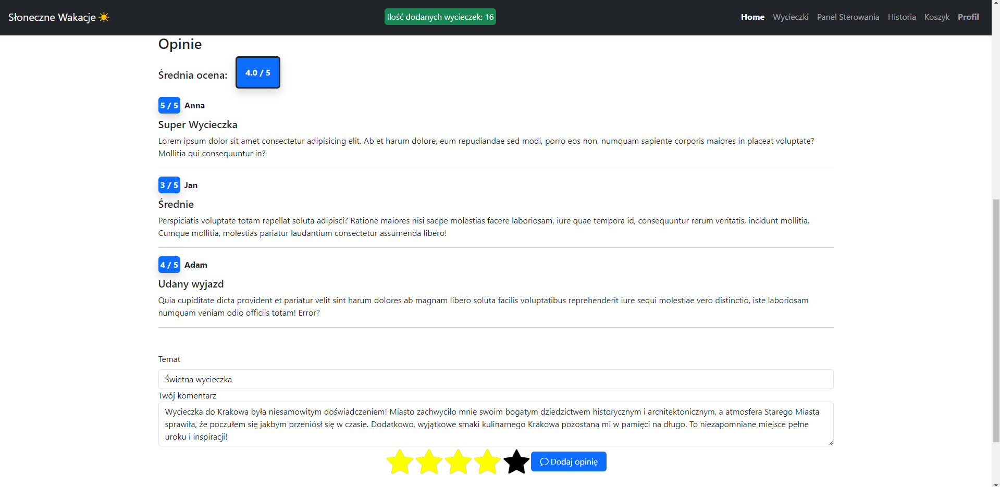
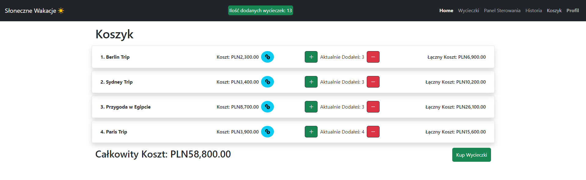

# TravelAgency
It's a web application for buying, commenting and managing trips.

## Description
Application created in Angular allows users to search the trips and opinions about them. If user wants to add the trip to shopping cart then he has to log in or create new account.
Logged user can buy all trips from his cart and add new oppinions about them in an view of the trip.
There is a admin role too which grant you a permision for delete existing trips and add new trips.

## Server
Angular application communicate with server to access all data. Server is created using Node.js and is connected to MongoDB which stored all info about users and trips.

## Sample website images

|            Main tab with trips              |
| ------------------------------------------- |
|  |

|              Main view with travel        |              Zoom of photo                 |              Opinions                 |
| ----------------------------------------- |--------------------------------------------| --------------------------------------|
| |  |  |

|              Shopping cart                  |
| ------------------------------------------- |
|  |
