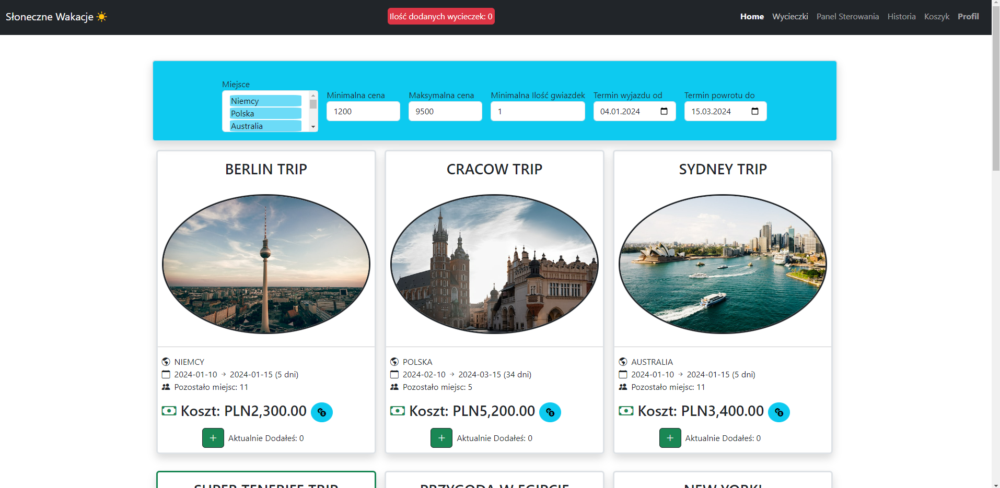

# TravelAgency
It's a web application for buying, commenting and managing trips.

## Description
Application created in Angular allows users to search the trips, comments about them. If user wants to add the trip to shopping cart then he has to log in or create new account.
Logged user can buy all trips from his cart and add new comments about them in an view of the trip.
There is an admin role too which grants you permision to delete existing trips and add new ones.

## Server
Angular application communicates with server to access all data. Server is created using Node.js and is connected to MongoDB which stores all info about users and trips. Link to [repo](https://github.com/this0is0kuba/travel_agency_server).

## Sample website images

|            Main tab with trips              |
| ------------------------------------------- |
|  |

|              Shopping cart          |              Zoom of photo                 |              Comments                 |
| ----------------------------------------- |--------------------------------------------| --------------------------------------|
| |  |  |

|               Main view of trip             |
| ------------------------------------------- |
|  |
